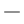

# US International Scientific Keyboard Layout
__A very powerful custom keyboard layout for Windows, tailored for efficient and convenient input of international Latin languages and scientific notation in plain text.__

- [Quick Start Guide](#quick-start-guide)
- [Update / Uninstallation Guide](#update--uninstallation-guide)
- [Must-know Concepts](#must-know-concepts)
	- [Dead keys](#dead-keys)
	- [Shift states and AltGr](#shift-states-and-altgr)
- [Overview of Key Mappings](#overview-of-key-mappings)
- [Core Design Ideas](#core-design-ideas)
- [Key Mappings](#key-mappings)
	- [Numeric row](#numeric-row)
		- [`AltGr` shift state](#altgr-shift-state)
		- [`AltGr` + `Shift` shift state](#altgr--shift-shift-state)
		- [Notes](#notes)
	- [QWERTY row](#qwerty-row)
		- [`AltGr` shift state](#altgr-shift-state-1)
		- [`AltGr` + `Shift` shift state](#altgr--shift-shift-state-1)
	- [ASDF row](#asdf-row)
		- [`AltGr` shift state](#altgr-shift-state-2)
		- [`AltGr` + `Shift` shift state](#altgr--shift-shift-state-2)
	- [ZXCV row](#zxcv-row)
		- [`AltGr` shift state](#altgr-shift-state-3)
		- [`AltGr` + `Shift` shift state](#altgr--shift-shift-state-3)
	- [Space bar](#space-bar)
- [Dead Key Secondary Mappings](#dead-key-secondary-mappings)
	- [Modified Latin letters](#modified-latin-letters)
	- [Mathematical alphanumeric symbols](#mathematical-alphanumeric-symbols)
	- [Mathematical operators](#mathematical-operators)
- [Comparison to Other Layouts](#comparison-to-other-layouts)
- [Bugs found in MSKLC - but it's a program that's almost older than myself!](#bugs-found-in-msklc---but-its-a-program-thats-almost-older-than-myself)

This keyboard layout is easy to install, easy to use, and easy to memorize, while having extensive capabilities covering common Latin letters, diacritics, mathematical symbols, additional punctuation, and some mathematical font letters. It is recommended for those who often work in __STEM__ fields on a __Windows__ system, and have collaborations with co-workers from __diverse language backgrounds__. It is also intended as a better alternative to the United States-International keyboard layout that had dead keys inconveniently bound on commonly used keys. 

> **Note:** This keyboard layout is **not a replacement for proper scientific notation** that can be formatted using rich-text programs like $\LaTeX$, UnicodeMath, or MathML, but rather a method to extend the symbols available in plain text input scenarios, e.g. texting on Discord, using Notepad, non-technical writing.

This keyboard layout was created using Microsoft Keyboard Layout Creator 1.4 (MSKLC 1.4). The layout is based on the common __English (United States) QWERTY keyboard layout__, and some designs are consistent with the _United States-International keyboard layout_. Other ideas were inspired by and improved on the basis of [Michael Goerz's version](https://michaelgoerz.net/notes/the-us-international-scientific-keyboard-layout/index.html) of the "U.S. International - Scientific" keyboard layout for Mac systems. 

A detailed comparison chart of this keyboard layout with other layouts can be found in [this section](#comparison-to-other-layouts). 

## Quick Start Guide
Setting up this keyboard on your computer is very simple! 

1. (_Optional_) Be logged in to an Administrator account on your computer. Configuring the keyboard will require Administrator permission. 
2. Download [the latest release](https://github.com/BelugaHaechi/US-International-Scientific-Keyboard/releases/latest) to any directory on your computer.
   > **Note:** Releases are named as `KBDUSS` + major version number + minor version letter. We will use `KBDUSS**` to represent this below. This naming system is in conformity with system files in `C:\Windows\System32\KBD*.dll`. 
3. Open the folder, and run the program `setup.exe` in the folder. Do not alter or delete any other files in the folder. 
4. Follow the setup instructions that will pop up. At some point, you will be asked for Administrator permission; please allow to continue.
5. Now the keyboard is installed on your computer! The last step is to enable the layout in Settings.
	- Open Settings on your computer.
	- Navigate to `Time & language > Language & region > Keyboards` (this may differ slightly for various Windows versions).
	- Select `Add a keyboard`, and select `US-International and Scientific keyboard` in the drop-down menu.
	- (_Optional_) You can now disable the original `US keyboard (QWERTY)`, since its functions could be completely replaced by the new keyboard.
6. Congratulations! You are now all set to use the US International Scientific keyboard on your computer.

> **Tip:** You may wish to retain the `KBDUSS**` folder, because it could be used to repair/uninstall the keyboard layout on your computer.

## Update / Uninstallation Guide
Uninstallation of the keyboard layout is also simple. You may wish to do so, if:
1. There is a new version of the keyboard available, and you will need to uninstall the previous version before installing the new one. Yes, minor improvements may be made to the layout upon request, feel free to post your ideas in Issues.
2. The keyboard layout doesn't work as intended on your device. If so, you may wish to reinstall the layout.
3. You wish to discard the layout for any reason :( Sad, but you are free to do so.

To uninstall the keyboard layout, simply revisit the `KBDUSS**` folder, and run `setup.exe` again. This time you would be prompted to repair or uninstall the keyboard layout, and select the action as you wish. Administrator permission may be required again. 

> **Known issue:** Possibly due to a Windows system bug, on uninstallation the keyboard layout will not be compeletely removed. Don't worry – this does not affect normal usage of other keyboard layouts. You may be still able to find the name of the layout in the keyboard layout list in computer settings, but if you try to add this layout to your input methods, it cannot appear in the input methods list for actual use. In other words, only a "ghost" placeholder of the layout will remain in the list. In the system files the keyboard layout's `.dll` configuration is deleted, but it is still registered somewhere as a blank case. 

## Must-know Concepts
The US International Scientific keyboard layout utilizes two important concepts to achieve its unparalleled functionality: **dead keys** and the **AltGr shift state**. These concepts, common in non-English keyboard layouts, are explained below for those unfamiliar with them. 

### Dead keys
When a normal key is pressed, a character is returned. However, [**dead keys**](https://en.wikipedia.org/wiki/Dead_key) do not return a character when initially pressed, but rather waits for the next keypress and uses this input to determine the character it should return. This essentially enables a key to be mapped to multiple characters, for example key `` ` `` (backtick) could be mapped to all characters with an acute accent: à, ù, ì, À, Ù, Ì, and so on. 

This comes at the cost of requiring two keypresses to access one character, as in the example to type `à` one would need to press `` ` `` then `a`. The character `` ` `` is called the **base character** of the dead key in this case. If the second keypress does not map to a character in the dead key's character set, the base character of the dead key is returned along with the second character. 

By convention, the set of characters mapped to a dead key should share similar features, and also with the base character. It is also conventional to always have the _space key_ mapped to the **default case** of a dead key, usually a blank version of the base character. Dead keys are used extensively in many modern keyboard layouts, such as in the Greek Polytonic layout, the US-International layout, the UK Extended layout, and so on. 

### Shift states and AltGr
**Shift state** is a term for the layers of a keyboard layout, that could be interchanged by the state of control keys (`Shift`, `Alt`, `Ctrl`). We normally use two shift states: the blank shift state, and the `Shift` shift state. In fact, there are extra shift states arising from the combinations of the 3 control keys. Among the most well known are the `Alt` + `Ctrl` and `Alt` + `Ctrl` + `Shift` shift states, commonly referred to as the **AltGr shift states** because they are accessed by holding the `AltGr` (short for Alternative Graphics) key on European keyboards. On keyboards without `AltGr`, hold the **Right `Alt` key** to access these shift states; holding down both `Alt` and `Ctrl` keys is also valid. `AltGr` expands a keyboard layout to twice the original size, enabling the addition of new functions. 

Shift states with only `Alt` or `Ctrl` are mostly unused in keyboard layouts, because these key combinations are reserved for hotkeys (keyboard shortcuts). 

In the US International Scientific keyboard layout, the key mappings in the normal shift states are identical to that in the common English (United States) QWERTY keyboard layout. Thus, without `AltGr`, it is just a normal layout; this feature is intended to make the transition to this layout extremely easy. All extra functionalities are carefully designed into the AltGr shift states, along with usage of dead keys.  

## Overview of Key Mappings
Below is a figure of the US International Scientific keyboard layout, made by [this tool](http://www.keyboard-layout-editor.com/#/) (also [on Github](https://github.com/ijprest/keyboard-layout-editor)). This figure may be greatly helpful as a reference to the functionalities of this keyboard layout. 

**Legend**

⚫ _Black:_ Normal keys. When pressed, returns the character shown. 

🔴 _Red:_ Dead keys. When pressed, waits for a second keypress, then returns a character based on the second keypress. 

🟣 _Purple:_ Dead keys, but due to restraints its base character does not well represent the set of characters mapped to the dead key. The former character in this representation is the base, the latter is the default case. 

🟥 _Red keycaps:_ At least one of the key's shift states is set as a dead key. 

🟦 _Blue keycaps:_ The key is used to control the shift states relevant to this layout. 

For details on the meaning and justification of each key-character mapping, please see [this section](#key-mappings). 

For details on the secondary mappings of dead keys, please jump to [this section](#dead-key-secondary-mappings). 

## Core Design Ideas
1. __Complete compatibility with plain keyboards.__ _The US QWERTY keyboard layout remains unchanged_, and all extensions are "hidden" in the `AltGr` (`Alt` + `Ctrl`) and `AltGr` + `Shift` (`Ctrl` + `Alt` + `Shift`) shift states. Therefore it will be just an ordinary layout under normal use, and fits with its positioning as a "keyboard extension".   
Also, key mappings from the original United States-International keyboard are retained whenever appropriate, so that it aligns with Microsoft design and users switching over will find it more familiar to work with. These mappings with be denoted with a `(USX)` mark, referencing the Windows `KBDUSX.dll` file containing setup information. 

2. __Consistent logicality of key mappings.__ Every key mapping should always _make as much sense as possible_ and provide convenience for both multilingual and mathematical input. Every reason for a certain mapping should be explicitly documented, and alternatives should be discussed if any. 
   - At least one among name, shape, usage, etc. of the character allocated should be related with the key that it is mapped to. 
   - Common characters should be easy to access, while uncommon characters should be set further out of reach, and rare and awkward characters should be avoided. 
   - Characters of the same type should have similar shift states, when possible.

3. __Compact organization by using dead keys.__ Multiple characters that share an obvious characteristic (best shown in its Unicode naming or block) should be considered to be included in a [dead key](https://en.wikipedia.org/wiki/Dead_key). Dead keys will be highlighted with a bold notice "__Dead key.__", and the mappings should be fully provided for reference. 
   - Dead key base characters should be chosen with the same criteria as normal characters. 
   - If the common characteristic is a diacritic, the base assignment should be the combining diacritic for versatility. If it is not, it should be meaningful as a fallback, or another related character (this is the hard part!). 
   - In dead key mappings, the final base character should be a space (U+0020) that maps to: 1) if diacritic, the diacritic itself alone (modifier letter); 2) if else, the most common character among all options. 
   - The dead key should provide access to this class of characters to the maximum extent, except for those that are rarely used. 

4. __Maximum flexibility under system restraints.__ Due to the restrictions imposed explicitly and implicitly, by MSKLC 1.4, Microsoft frameworks, and related bugs, the scope of design and functionality of this keyboard layout is somewhat restricted. However, under these restrictions, the design will strive to include the most functionality possible without causing compatibility issues. 
   - Mathematical Greek letters are fully supported as in §2.2 of [Unicode® Technical Report #25: Unicode Support For Mathematics](https://www.unicode.org/reports/tr25/).
   - **The range of Unicode characters included is limited. All output only include one character or code point. All output characters are within the Basic Multilingual Plane (BMP) of Unicode (U+0000..U+FFFF). All dead key base assignments are within U+0000..U+0FFF.** Currently most characters are within U+0000..U+2FFF. 
   - Customization is not imposed on control keys, numpad, arrow keys, and function keys. 
   - Dead keys are not chained, and all base characters are available in the normal and `Shift` shift states. 
   - Shift states only include normal, `Shift`, `AltGr` (`Ctrl+Alt`), and `Shift+AltGr` (`Ctrl+Alt+Shift`). Excluded states include `Ctrl`, `Ctrl+Shift`, `SGCaps` (`CapsLock`), and so on.

## Key Mappings
Below is a detailed documentation on the complete set of key mappings for the US International Scientific keyboard layout, including specific descriptions of the characters selected and the corresponding justifications. 
### Numeric row
#### `AltGr` shift state
|Key|Char|Unicode|Character|Description|
|:-:|:--:|:-----:|---------|-----------|
|`` ` ``|`   |U+0300|COMBINING GRAVE ACCENT|**Dead key: characters with the grave accent diacritic.** Shape similar to U+0060 GRAVE ACCENT (backtick). Retained from USX layout. |
|`1`|′   |U+2032|PRIME|Math: first (1) derivative. |
|`2`|″   |U+2033|DOUBLE PRIME|Math: second (2) derivative. |
|`3`|‴   |U+2034|TRIPLE PRIME|Math: third (3) derivative. |
|`4`|¤   |U+00A4|CURRENCY SIGN|Retained from USX layout. Related to the `Shift` shift state mapping mapping of U+0024 DOLLAR SIGN. |
|`5`|€   |U+20AC|EURO SIGN|Retained from USX layout. Near other currency characters. |
|`6`|ˇ   |U+030C|COMBINING CARON|**Dead key: characters with the caron diacritic.** Mirror image of U+0302 COMBINING CIRCUMFLEX ACCENT. |
|`7`|⃗   |U+20D7|COMBINING RIGHT ARROW ABOVE|Physics: vector notation. Shape of 7 similar to right arrow. Near other combining diacritical marks. |
|`8`|∞   |U+221E|INFINITY|Math. Shape similar to a turned 8. |
|`9`|∝   |U+221D|PROPORTIONAL TO|Math. Near U+221E INFINITY. Shape similar to a turned 9, or a turned 8 with an opening. |
|`0`|°   |U+030A|COMBINING RING ABOVE|**Dead key: characters with a ring above, expanded to related non-math symbols.** Shape similar to 0, also the key is positioned at the top of the keyboard (Thus mapping to key `0` is prioritized over `O`). |
|`-`|–   |U+2013|EN DASH|Punctuation: commonly used as the dash indicating ranges of numbers. Shorter than U+2014 EM DASH, so mapped to the hyphen which is shorter than the underscore. |
|`=`|ª   |U+00AA|FEMININE ORDINAL INDICATOR|**Dead key: subscript characters.** Conventionally, the hotkey for subscripts is `Ctrl` + `=` in rich text programms such as MS Word. Also, Unicode provides a full set of subscripts for numbers, which relates to the position of this key (at the top of the keyboard). **Base character and default case** is U+00AA FEMININE ORDINAL INDICATOR in pair with U+00BA MASCULINE ORDINAL INDICATOR, because they are essentially superscripts. |

#### `AltGr` + `Shift` shift state
|Key|Char|Unicode|Character|Description|
|:-:|:--:|:-----:|---------|-----------|
|`~`|˜   |U+0303|COMBINING TILDE|**Dead key: characters with the tilde diacritic, extended to similar math equality symbols.** Shape similar to U+007E TILDE. Retained from USX layout. |
|`!`|¡   |U+00A1|INVERTED EXCLAMATION MARK|Punctuation: used to begin exclamations in Spanish languages. Partially retained from USX layout, changed shift state for better accordance with U+0021 EXCLAMATION MARK. |
|`@`|√   |U+221A|SQUARE ROOT|Math: second (2) root. |
|`#`|∛   |U+221B|CUBE ROOT|Math: third (3) root. |
|`$`|£   |U+00A3|POUND SIGN|Retained from USX layout. Near other currency characters. |
|`%`|‰   |U+2030|PER MILLE SIGN|Shape and usage similar to U+0025 PERCENT SIGN on the same key. |
|`^`|ˆ   |U+0302|COMBINING CIRCUMFLEX ACCENT|**Dead key: characters with the circumflex diacritic.** Shape similar to U+005E CIRCUMFLEX ACCENT on the same key. Retained from USX layout. |
|`&`|¦   |U+00A6|BROKEN BAR|**Dead key: ligatures, extended to related punctuation symbols.** Usage of U+0026 AMPERSAND related to the fact that ligatures are joined characters. **Base character** is U+00A6 BROKEN BAR because 1) there is no valid and representative character in the set of ligatures, 2) it is an important character also covered in the USX layout, and 3) its shape suggests the idea of joining two objects. **Default case** is U+200D ZERO WIDTH JOINER, commonly used to compose composite graphemes, especially in emojis. |
|‍`*`|⋅   |U+22C5|DOT OPERATOR|Math: dot multiplication. Usage similar to the multiplication meaning of U+002A ASTERISK on this key. |
|`(`|⟨   |U+27E8|MATHEMATICAL LEFT ANGLE BRACKET|Physics: Bra-ket notation left bound. Shape and usage similar to U+0028 LEFT PARENTHESIS. |
|`)`|⟩   |U+27E9|MATHEMATICAL RIGHT ANGLE BRACKET|Physics: Bra-ket notation right bound. Shape and usage similar to U+0029 RIGHT PARENTHESIS. |
|`_`|—   |U+2013|EM DASH|Punctuation: commonly used as the dash indicating breaks in sentences. Longer than U+2014 EM DASH, so mapped to the underscore which is longer than the hyphen. |
|`+`|º   |U+00BA|MASCULINE ORDINAL INDICATOR|**Dead key: superscript characters.** Conventionally, the hotkey for subscripts is `Ctrl` + `+` in rich text programms such as MS Word. Also, Unicode provides a full set of subscripts for numbers, which relates to the position of this key (at the top of the keyboard). **Base character and default case** is U+00BA MASCULINE ORDINAL INDICATOR in pair with U+00AA FEMININE ORDINAL INDICATOR, because they are essentially superscripts. |

#### Notes
1. There exists U+2057 QUADRUPLE PRIME and U+221C FOURTH ROOT as candidates for key `4`, but they were not chosen because 1) these characters are rarely used (we live in a 3-dimensional world), and 2) there exists reasonable USX layout options to retain (which were used in this layout).
2. The superscripts and subscripts provided are limited intentionally by Unicode, in a way that not every letter in the alphabet has one. Most of these mini letters were coded in the first place for IPA phonetics! It is suggested to always use rich text to achieve such styles for normal text, and this keyboard layout provides these choices only to aid in plain text communication. 
3. For keys `=` and `+`, for the pair of characters U+00BA MASCULINE ORDINAL INDICATOR and U+00AA FEMININE ORDINAL INDICATOR, the decision to map the former to the shifted shift state was based on the fact that masculinity is usually associated with outgoing character. Here no bias on gender and sex is intended; this was solely based on general social observation, which is subject to change as society progresses. It is thoroughly acknowledged that females could express masculinity and vice versa, and there are other gender identities apart from the binary system.  

### QWERTY row
#### `AltGr` shift state
|Key|Char|Unicode|Character|Description|
|:-:|:--:|:-----:|---------|-----------|
|`q`|÷   |U+00F7|DIVISION SIGN|Math. The result of division, quotient, starts with the letter "q". Has same shift state as U+00D7 MULTIPLICATION SIGN (mapped to key `x`), another common math operator. |
|`w`|ϵ   |U+03F5|GREEK LUNATE EPSILON SYMBOL|Shape similar to a turned "w". Key `e` is reserved for "element of"-related (set membership) symbols. |
|`e`|϶   |U+03F6|GREEK REVERSED LUNATE EPSILON SYMBOL|**Dead key: set membership math symbols.** **Base character** has a shape similar to a reversed "e", and is near its mirror image U+03F5 GREEK LUNATE EPSILON SYMBOL. **Default case** is U+2208 ELEMENT OF, which starts with the letter "e". |
|`r`|®   |U+00AE|REGISTERED SIGN|Retained from USX layout. Shape of symbol includes the letter "R". |
|`t`|†   |U+2020|DAGGER|Often used for marking footnotes, also used in math/physics for the conjugate (Hermitian) transpose. Shape similar to letter "t". |
|`y`|±   |U+00B1|PLUS-MINUS SIGN|**Dead key: math symbols comprised of horizontal and vertical lines, such as logical operators.** Shapes similar to the crossed shape of the letter "y", which also notes that the characters in this set could comprise of lines towards all directions. **Base character and default case** is U+00B1 PLUS-MINUS SIGN because it is most commonly used, and is the only character in this set which has a code point that is valid for a dead key. |
|`u`|∪   |U+222A|UNION|Math: set notation. Shape similar to letter "U". |
|`i`|ı   |U+0131|LATIN SMALL LETTER DOTLESS I|Math: imaginary unit in some fields, eg. engineering. Also used in some languages, eg. Azerbaijani, Turkish. Shape similar to letter "i". |
|`o`|ϕ   |U+03D5|GREEK PHI SYMBOL|**Dead key: circle-related math symbols.** Shapes include a circle, similar to shape of letter "o". **Base character and default case** is U+03D5 GREEK PHI SYMBOL, a common Greek variable name in math. Note for Greek language, U+03C6 GREEK SMALL LETTER PHI (φ) is used. |
|`p`|∐   |U+2210|N-ARY COPRODUCT|Math: collection operator in abstract algebra. Mirror image of U+220F N-ARY PRODUCT. |
|`[`|‹   |U+2039|SINGLE LEFT-POINTING ANGLE QUOTATION MARK|Punctuation: left single quotation mark in some European languages. Used in pairs, similar to brackets. Shift state in accordance with single/double quotation marks. 
|`]`|›   |U+203A|SINGLE RIGHT-POINTING ANGLE QUOTATION MARK|Punctuation: right single quotation mark in some European languages. Justification similar to U+2039 SINGLE LEFT-POINTING ANGLE QUOTATION MARK. |
|`\`|↓   |U+2193|DOWNWARDS ARROW|Meaning related to U+005C REVERSE SOLIDUS (backslash) that indicates a falling notion. Mirror image of U+2191 UPWARDS ARROW. |

#### `AltGr` + `Shift` shift state
|Key|Char|Unicode|Character|Description|
|:-:|:--:|:-----:|---------|-----------|
|`Q`|≡   |U+2261|IDENTICAL TO|Math: congruency, equivalence. Related to "equality", which has the letter `q`. This symbol has a stronger mathematical meaning than U+00F7 DIVISION SIGN, and thus is mapped to the shifted shift state. |
|`W`|∑   |U+2211|N-ARY SUMMATION|Math: sigma summation notation. Shape similar to a turned "W". Key `E` is reserved for U+2203 THERE EXISTS, which resembles the letter "E" more. |
|`E`|∃   |U+2203|THERE EXISTS|Math: existential quantifier. Shape similar to a reversed letter "E". |
|`R`|™   |U+2122|TRADE MARK SIGN|Usage highly related to U+00AE REGISTERED SIGN mapped to the same key. |
|`T`|‡   |U+2021|DOUBLE DAGGER|Often used for marking footnotes, also used in chemistry to denote a transition state. Shape similar to letter "t" and U+2020 DAGGER mapped to the same key. |
|`Y`|¥   |U+00A5|YEN SIGN|Shape similar to letter "Y". Near other currency signs. |
|`U`|∩   |U+2229|INTERSECTION|Math: set notation. Mirror image of U+222A UNION mapped to the same key. |
|`I`|ʃ   |U+0283|LATIN SMALL LETTER ESH|**Dead key: integral math symbols.** The name "integral" begins with the letter "i". Also integrals are large math operators, so they are mapped to capital key "I". **Base character and default case** is U+0283 LATIN SMALL LETTER ESH becuase it is a useful latin letter that resembles an integral, while all integral characters in this set have code points that are invalid for a dead key. |
|`O`|∅   |U+2205|EMPTY SET|Math: set notation. Shape similar to letter "O" and U+03D5 GREEK PHI SYMBOL mapped to the same key. |
|`P`|∏   |U+220F|N-ARY PRODUCT|Math: pi multiplication notation. Resembles Greek capital letter pi, which starts with the letter "p". Mirror image of U+2210 N-ARY COPRODUCT. |
|`{`|«   |U+00AB|LEFT-POINTING DOUBLE ANGLE QUOTATION MARK|Punctuation: left double quotation mark in some European languages (eg. French guillemets). Used in pairs, similar to braces. Shift state in accordance with single/double quotation marks. |
|`}`|»   |U+00BB|RIGHT-POINTING DOUBLE ANGLE QUOTATION MARK|Punctuation: right double quotation mark in some European languages (eg. French guillemets). Justification similar to U+00AB LEFT-POINTING DOUBLE ANGLE QUOTATION MARK. |
|`\|`|↑   |U+2191|UPWARDS ARROW|Shape similar to U+007C VERTICAL BAR mapped to this key. Indicates upward motion, which is related to the `Shift` key icon. Mirror image of U+2193 DOWNWARDS ARROW. |

### ASDF row
#### `AltGr` shift state
|Key|Char|Unicode|Character|Description|
|:-:|:--:|:-----:|---------|-----------|
|`a`|ɐ   |U+0250|LATIN SMALL LETTER TURNED A|**Dead key: set inclusion math symbols.** Mainly mapped to this key in accordance with key mappings of set membership symbols and U+2203 THERE EXISTS to key `E`. U+2220 ANGLE is also included for its similar shape with these symbols and its name starting with letter "a". **Base character** has a shape similar to a turned "a". **Default case** is U+2282 SUBSET OF, which is representative. |
|`s`|ß   |U+00DF|LATIN SMALL LETTER SHARP S|Common letter in German language. Shape and usage similar to letter "s". Retained from USX layout. |
|`d`|∂   |U+2202|PARTIAL DIFFERENTIAL|Math: calculus. Shape is essentially a variant of letter "d". |
|`f`|ϝ   |U+03DD|GREEK SMALL LETTER DIGAMMA|Math: variable name. Shape similar to letter "f". Required to be included in UTR25. |
|`g`|γ   |U+03B3|GREEK SMALL LETTER GAMMA|**Dead key: Greek letters, expanded to other math variable letters.** The name "Greek" starts with the letter "g". The secondary keypresses for this dead key is based on the Greek QWERTY keyboard layout. **Base character and default case** is U+03B3 GREEK SMALL LETTER GAMMA because it is the Greek version of letter "g", and also mapped so in the Greek QWERTY keyboard layout. |
|`h`|ℏ   |U+210F|PLANCK CONSTANT OVER TWO PI|Physics: reduced Plank's constant. Shape similar to letter "h". |
|`j`|←   |U+2190|LEFTWARDS ARROW|Shape of letter "J" points to the left, similar to a mirror image of letter "L". Conventionally, many video websites (eg. Youtube) map rewind/pause/foward shortcuts to keys `J`, `K`, and `L`. |
|`k`|↔   |U+2194|LEFT RIGHT ARROW|Letter "K" positioned between letters "J" and "L" mapped to the left and right arrows. Shape of letter "K" also points to two directions. |
|`l`|→   |U+2192|RIGHTWARDS ARROW|Shape of letter "L" points to the left, similar to a mirror image of letter "J". Justification similar to U+2190 LEFTWARDS ARROW. |
|`;`|∴   |U+2234|THEREFORE|Math: indicates logical consequence in proofs, especially for geometry. Shape has multiple dots, similar to the colon and semicolon. In pair with U+2235 BECAUSE, but normally used after it, thus mapped to the non-shifted shift state. |
|`'`|´   |U+0301|COMBINING ACUTE ACCENT|**Dead key: characters with the acute accent diacritic.** Shape of apostrophe similar to acute accent. Retained from USX layout. |

#### `AltGr` + `Shift` shift state
|Key|Char|Unicode|Character|Description|
|:-:|:--:|:-----:|---------|-----------|
|`A`|∀   |U+2200|FOR ALL|Math: universal quantifier. Shape similar to a turned letter "A". |
|`S`|§   |U+00A7|SECTION SIGN|Shape includes two letter "S"s. Retained from USX layout. |
|`D`|∆   |U+2206|INCREMENT|Math: indicates the difference of the value of a variable resulting from change. Shape similar to Greek capital letter delta. Related to U+2202 PARTIAL DIFFERENTIAL mapped to the same key. |
|`F`|Ϝ   |U+03DC|GREEK LETTER DIGAMMA|Math: variable name. Shape similar to letter "F". Required to be included in UTR25. |
|`G`|∇   |U+2207|NABLA|Physics: differential operator. Describes gradient, which starts with letter "g". Similar to an inverted Greek capital delta, that also shares the same shift state with this character. Near other Greek letters. |
|`H`|Ħ   |U+0126|LATIN CAPITAL LETTER H WITH STROKE|**Dead key: letters with the mathematical Fraktur (Black-letter or Gothic) font.** Due to Windows limitations, only a few such letters are available. **Base character** is U+0126 LATIN CAPITAL LETTER H WITH STROKE only as a representation of the special font, while all Fraktur letters are not valid as dead key base characters; this character is by intent not mapped to a secondary keypress because it is only a placeholder and not a Fraktur letter. **Default character** is U+210C BLACK-LETTER CAPITAL H (ℌ), which is commonly used in physics for Hilbert space. |
|`J`|⇐   |U+21D0|LEFTWARDS DOUBLE ARROW|Justification similar to U+2190 LEFTWARDS ARROW. Mapped to shifted state because it is double-stroke, a variant of the single arrow. |
|`K`|⇔   |U+21D4|LEFT RIGHT DOUBLE ARROW|Justification similar to U+2194 LEFT RIGHT ARROW. Mapped to shifted state because it is double-stroke, a variant of the single arrow. |
|`L`|⇒   |U+21D2|RIGHTWARDS DOUBLE ARROW|Justification similar to U+2192 RIGHTWARDS ARROW. Mapped to shifted state because it is double-stroke, a variant of the single arrow. |
|`:`|∵   |U+2235|BECAUSE|Math: indicates logical conditions in proofs, especially for geometry. Shape has multiple dots, similar to the colon and semicolon. In pair with U+2234 THEREFORE, but normally used first, thus mapped to the shifted shift state. |
|`"`|¨   |U+0308|COMBINING DIAERESIS|**Dead key: characters with the diaeresis diacritic, extended to diacritics with one or multiple dots.** Shape of quotation mark similar to diaeresis accent. Retained from USX layout. |

### ZXCV row
#### `AltGr` shift state
|Key|Char|Unicode|Character|Description|
|:-:|:--:|:-----:|---------|-----------|
|`z`|≠   |U+2260|NOT EQUAL TO|Math. Shape similar to letter "z". Has the same shift state as the equals sign ("="). |
|`x`|×   |U+00D7|MULTIPLICATION SIGN|Math. Shape similar to letter "x". Has same shift state as U+00F7 DIVISION SIGN (mapped to key `x`), another common math operator. |
|`c`|©   |U+00A9|COPYRIGHT SIGN|Shape includes letter "c". Retained from USX layout. |
|`v`|∨   |U+2228|LOGICAL OR|Math: logical operator. Shape similar to letter "v". |
|`b`|ˉ   |U+0304|COMBINING MACRON|**Dead keys: characters with the macron diacritic, extended to overline diacritics.** The shapes of these diacritics are usually called "bars" (especially in physics), which starts with letter "b". This key was originally intended for only U+0305 COMBINING OVERLINE for use in math and physics (denoting averages), then extended. |
|`n`|¬   |U+00AC|NOT SIGN|Math: logical operator. The name "not" starts with letter "n". |
|`m`|↦   |U+21A6|RIGHTWARDS ARROW FROM BAR|Math: function notation. Commonly called the maplet, which starts with letter "m". |
|`,`|¸   |U+0327|COMBINING CEDILLA|**Dead key: characters with the cedilla or ogonek diacritic.** Shape of cedilla similar to the comma, while shape of ogonek similar to a reversed comma. The two diacritics are mutually exclusive on a letter, thus they are mapped to the same key. |
|`.`|·   |U+00B7|MIDDLE DOT|**Dead key: punctuation with multiple dots.** Shape similar to the period. Not to be confused with U+22C5 DOT OPERATOR (⋅), which should be used exclusively for dot multiplication in math. In accordance with $\LaTeX$, includes the family of `\cdot`, `\cdots`, `\vdots`, etc. Mainly used to abbreviate the elements of a matrix. |
|`/`|̸   |U+0338|COMBINING LONG SOLIDUS OVERLAY|**Dead key: characters with a stroke.** Shape similar to the solidus. Standard combining character for "crossing out" other characters in Unicode. **Default case** is U+2044 FRACTION SLASH, which has a similar shape with the solidus, and also represents the usage of the solidus as the division operator. |

#### `AltGr` + `Shift` shift state
|Key|Char|Unicode|Character|Description|
|:-:|:--:|:-----:|---------|-----------|
|`Z`|Ƶ   |U+01B5|LATIN CAPITAL LETTER Z WITH STROKE|**Dead key: letters with the mathematical double-struck font.** Due to Windows limitations, only a few such letters are available. **Base character** is U+01B5 LATIN CAPITAL LETTER Z WITH STROKE only as a representation of the special font, while all double-struck letters are not valid as dead key base characters; this character is by intent not mapped to a secondary keypress because it is only a placeholder and not a double-struck letter. **Default character** is U+2124 DOUBLE-STRUCK CAPITAL Z (ℤ), which is commonly used in math for the set of integers. |
|`X`|≈   |U+2248|ALMOST EQUAL TO|Math. Denotes approximation, which has the sound of letter "x". Has the same shift state as U+2261 IDENTICAL TO, both equality-related symbols. |
|`C`|¢   |U+00A2|CENT SIGN|Shape similar to letter "c". Similarly in a shifted shift state as the dollar sign. Retained from USX layout. |
|`V`|∧   |U+2227|LOGICAL AND|Math: logical operator, conjunction. Mirror image of U+2228 LOGICAL OR. |
|`B`|˘   |U+0306|COMBINING BREVE|**Dead key: characters with the breve diacritic.** The name "breve" starts with the letter "b". |
|`N`|⊻   |U+22BB|XOR|Math: logical operator, exclusive disjunction. Expresses an alternative version of OR, so mapped to the same key as U+00AC NOT SIGN; but this does not mean that this is a negated version of OR (XOR is not NOR). Near other logical operators. |
|`M`|µ   |U+00B5|MICRO SIGN|**Dead key: letters with the mathematical script font.** Due to Windows limitations, only a few such letters are available. **Base character** is U+00B5 MICRO SIGN, whose name starts with letter "m". Itself is a deprecated symbol identical to Greek small letter mu (μ), and the latter should always be used. Here it is a placeholder, while all script letters are not valid as dead key base characters; this character is by intent not mapped to a secondary keypress because it is only a placeholder and not a script letter. **Default character** is U+2133 SCRIPT CAPITAL M (ℳ), which is the symbol for the M-matrix in physics, and the pre-WWII German Mark. |
|`<`|<   |U+003C|LESS-THAN SIGN|**Dead key: variants of the less-than sign in math.** **Base character** is the plain less-than sign because all of its variants are not valid as dead key base characters. **Default case** is U+2264 LESS-THAN OR EQUAL TO as the most common and simple variant. |
|`>`|>   |U+003E|GREATER-THAN SIGN|**Dead key: variants of the greater-than sign in math.** **Base character** is the plain greater-than sign because all of its variants are not valid as dead key base characters. **Default case** is U+2265 GREATER-THAN OR EQUAL TO as the most common and simple variant. |
|`?`|¿   |U+00BF|INVERTED QUESTION MARK|Punctuation: used to begin interrogations in Spanish languages. Partially retained from USX layout, changed shift state for better accordance with U+003F QUESTION MARK. |

### Space bar
- **`AltGr` shift state:** U+00A0 NO-BREAK SPACE. Special whitespace in typesetting that prevents an automatic line break at its position. 
- **`AltGr` + `Shift` shift state:** U+200B ZERO WIDTH SPACE. Special whitespace that has no width, which could serve as implicit word boundaries in typesetting. Not to be confused with U+200D ZERO WIDTH JOINER available at key `&`, that is for joining and composing graphemes. 

## Dead Key Secondary Mappings
For convenience and ease of memory, the 26 dead keys in the US International Scientific keyboard layout are listed below in groups sharing similar design logic, instead of original order. 

### Modified Latin letters
|Category|Grave accents|
|:------:|---|
|Dead key|`AltGr` + `` ` ``|
|Base character|U+0300 COMBINING GRAVE ACCENT (◌̀)|
|Secondary keys|`aeiouyw AEIOUYW`|
|Characters|àèìòùỳẁ ÀÈÌÒÙỲẀ|
|Default case|U+0060 GRAVE ACCENT (`)|

|Category|Tilde diacritic + math equality symbols|
|:------:|---|
|Dead key|`AltGr` + `~`|
|Base character|U+0303 COMBINING TILDE (◌̃)|
|Secondary keys|`aeiouynv AEIOUYNV -=`|
|Characters|ãẽĩõũỹñṽ ÃẼĨÕŨỸÑṼ ≃≅|
|Default case|U+00DC SMALL TILDE (˜)|
|Notes|Two common mathematical equality operators with related shapes are included, respectively U+2243 ASYMPTOTICALLY EQUAL TO, U+2245 APPROXIMATELY EQUAL TO. 

|Category|Caron diacritic|
|:------:|---|
|Dead key|`AltGr` + `6`|
|Base character|U+030C COMBINING CARON (◌̌)|
|Secondary keys|`aeiou cdgjklnrstz AEIOU CDGKLNRSTZ`|
|Characters|ǎěǐǒǔ čďǧǐǰǩľňřšťž ǍĚǏǑǓ ČĎǦǏǨĽŇŘŠŤŽ|
|Default case|U+02C7 CARON (ˇ)|
|Notes|For unknown reasons, Unicode does not include capital letter "J" with caron, although its lowercase form is encoded. Certain letters may have a different display for the caron, such as an apostrophe at the upper right corner. |

|Category|Circumflex accents|
|:------:|---|
|Dead key|`AltGr` + `^`|
|Base character|U+0302 COMBINING CIRCUMFLEX ACCENT (◌̂)|
|Secondary keys|`aeiouy cghjsw AEIOUY CGHJSW`|
|Characters|âêîôûŷ ĉĝĥĵŝŵ ÂÊÎÔÛŶ ĈĜĤĴŜŴ|
|Default case|U+02C6 MODIFIER LETTER CIRCUMFLEX ACCENT (ˆ)|

|Category|Ring above diacritic + circle symbols|
|:------:|---|
|Dead key|`AltGr` + `0`|
|Base character|U+030A COMBINING RING ABOVE (◌̊)|
|Secondary keys|`au AU CF oO.b -`|
|Characters|åů ÅŮ ℃℉ ○◯◌● ᶱ|
|Default case|U+00B0 DEGREE SIGN (°)|
|Notes|Includes related symbols: degree Celsius/Fahrenheit, white/large/dotted/black circles, and U+1DB1 MODIFIER LETTER SMALL BARRED O (ᶱ) as an acceptable *approximation* for the barred circle notation of standard state in chemistry. 

|Category|Acute accent|
|:------:|---|
|Dead key|`AltGr` + `'`|
|Base character|U+0301 COMBINING ACUTE ACCENT (◌́)|
|Secondary keys|`aeiouy cgklmnprswz AEIOUY CGKLMNPRSWZ`|
|Characters|áéíóúý ćǵḱĺḿńṕŕśẃź ÁÉÍÓÚÝ ĆǴḰĹḾŃṔŔŚẂŹ|
|Default case|U+00B4 ACUTE ACCENT (´)|

|Category|Diaeresis diacritic + dot diacritics|
|:------:|---|
|Dead key|`AltGr` + `"`|
|Base character|U+0308 COMBINING DIAERESIS (◌̈)|
|Secondary keys|`aeiouy htw AEIOUY HW 1234`|
|Characters|äëïöüÿ ḧẗẅ ÄËÏÖÜ ḦẄ ◌̇◌̈ ⃛ ⃜|
|Default case|U+00A8 DIAERESIS (¨)|
|Notes|For unknown reasons, Unicode does not include capital letter "T" with diaeresis, although its lowercase form is encoded. Combining diacritical marks with 1–4 dots above are included, which are commonly used to indicate time derivatives in physics. |

|Category|Macron diacritic + bar diacritics|
|:------:|---|
|Dead key|`AltGr` + `b`|
|Base character|U+0304 COMBINING MACRON (◌̄)|
|Secondary keys|`aeioug AEIOUG -=_`|
|Characters|āēīōūḡ ĀĒĪŌŪḠ ◌̅◌̿¯|
|Default case|U+02C9 MODIFIER LETTER MACRON (ˉ)|
|Notes|Includes related combining diacritical marks: U+0305 COMBINING OVERLINE (denotes averages in math), U+033F COMBINING DOUBLE OVERLINE. Includes U+00AF MACRON, a longer variant of the modifier letter from legacy. 

|Category|Breve diacritic|
|:------:|---|
|Dead key|`AltGr` + `B`|
|Base character|U+0306 COMBINING BREVE (◌̆)|
|Secondary keys|`aeioug AEIOUG`|
|Characters|ăĕĭŏŭğ ĂĔĬŎŬĞ|
|Default case|U+02D8 BREVE (˘)|

|Category|Cedilla and ogonek diacritics|
|:------:|---|
|Dead key|`AltGr` + `,`|
|Base character|U+0327 COMBINING CEDILLA (◌̧)|
|Secondary keys|`aeiou cdghklnrst AEIOU CDGHKLNRST \\|`|
|Characters|ąęįǫų çḑģḩķļņŗşţ ĄĘĮǪŲ ÇḐĢḨĶĻŅRŞŢ ◌̨ ˛|
|Default case|U+00B8 CEDILLA (¸)|
|Notes|Since only consonants can have a cedilla while only vowels can have an ogonek, being mutually exclusive, the two diacritics are included in the same key. Certain letters may have a different display for the cedilla, such as having the shape of an apostrophe. Includes the combining diacritical mark and modifier letter for the ogonek, respectively mapped to `\` and `\|` since the ogonek and cedilla are approximately mirror images. |

|Category|Stroked letters + fraction slash|
|:------:|---|
|Dead key|`AltGr` + `\`|
|Base character|U+0338 COMBINING LONG SOLIDUS OVERLAY (◌̸)|
|Secondary keys|`bdghilotz DGHILOTZ`|
|Characters|ƀđǥħɨłøŧƶ ĐǤĦƗŁØŦƵ|
|Default case|U+2044 FRACTION SLASH (⁄)|
|Notes|This combining diacritical mark (U+0338) is also the standard combining character for "crossing out" other characters in Unicode, for example negating math operators: U+003D (=) + U+0338 ⇔ U+2260 (≠). For unknown reasons, Unicode does not include capital letter "B" with stroke, although its lowercase form is encoded. |

|Category|Ligatures + North European letters|
|:------:|---|
|Dead key|`AltGr` + `&`|
|Base character|U+00A6 BROKEN BAR (¦)|
|Secondary keys|`ao ilnd AO ILND tT eE &\|`|
|Characters|æœ ijljnjdz ÆŒ IJLJNJDZ þÞ ðᴆ ⅋¦|
|Default case|U+200D ZERO WIDTH JOINER (‍)|
|Notes|The default case U+200D ZERO WIDTH JOINER is a special invisible whitespace (thus mapped to the space bar) that is the standard combining character for composing multiple graphemes, such as adding skin color in emojis. Includes North European letters thorn and eth, and loosely-related characters U+214B TURNED AMPERSAND (⅋, used in linear logic) and U+00A6 BROKEN BAR (¦, for [legacy](https://en.wikipedia.org/wiki/Vertical_bar#Solid_vertical_bar_vs_broken_bar)). |

### Mathematical alphanumeric symbols
|Category|Subscripts|
|:------:|---|
|Dead key|`AltGr` + `=`|
|Base character|U+00AA FEMININE ORDINAL INDICATOR (ª)|
|Secondary keys|`0123456789+-=() aehijklmnoprstuvx`|
|Characters|₀₁₂₃₄₅₆₇₈₉₊₋₌₍₎ ₐₑₕᵢⱼₖₗₘₙₒₚᵣₛₜᵤᵥₓ|
|Default case|U+00AA FEMININE ORDINAL INDICATOR (ª)|
|Notes|Not all subscript lowercase letters are available in Unicode. |

|Category|Superscripts|
|:------:|---|
|Dead key|`AltGr` + `+`|
|Base character|U+00BA MASCULINE ORDINAL INDICATOR (º)|
|Secondary keys|`0123456789+-=()` `abcdefghijklmnoprstuvwxyz` `ABCDEFGHIJKLMNOPQRTUVW`|
|Characters|⁰¹²³⁴⁵⁶⁷⁸⁹⁺⁻⁼⁽⁾ ᵃᵇᶜᵈᵉᶠᵍʰⁱʲᵏˡᵐⁿᵒᵖʳˢᵗᵘᵛʷˣʸᶻ ᴬᴮꟲᴰᴱꟳᴳᴴᴵᴶᴷᴸᴹᴺᴼᴾꟴᴿᵀᵁⱽᵂ|
|Default case|U+00BA MASCULINE ORDINAL INDICATOR (º)|
|Notes|All superscript lowercase letters except "q" (U+107A5, non-BMP characters are not supported) are available on this keyboard. For superscript capital letters, "S", "X", "Y", and "Z" are missing. |

|Category|Greek letters with variants + first 4 Hebrew letters|
|:------:|---|
|Dead key|`AltGr` + `g`|
|Base character|U+03B3 GREEK SMALL LETTER GAMMA (γ)|
|Secondary keys|`qwertyuiop` `asdfghjkl` `zxcvbnm` `QWERTYUIOP` `ASDFGHJKL` `ZXCVBNM` `123456`|
|Characters|ϑςερτυθιοπ ασδφγηξκλ ζχψωβνμ ϴϖΕΡΤΥΘΙΟΠ ΑΣΔΦΓΗΞΚΛ ΖΧΨΩΒΝΜ ℵℶℷℸϰϱ|
|Default case|U+03B3 GREEK SMALL LETTER GAMMA (γ)|
|Notes|These letters are included in the Basic Set of Alphanumeric Characters for mathematical notation (see §2.2 of [UTR25](http://www.unicode.org/reports/tr25/)). For convenience and consistency, the mappings are mostly identical to the standard Greek keyboard layout. Greek diacritics were removed. Key `w` is retained as the lowercase final sigma. Keys `QqW` are mapped respectively to U+03F4 (ϴ ↔ Θ), U+03D1 (ϑ ↔ θ), and U+03D6 (ϖ ↔ π), based on their similar shapes. Keys `1234` are the first 4 capital Herbrew letters Alef, Bet, Gimel, and Dalet. Keys `56` are mapped respectively to U+03F0 (ϰ ↔ κ) and U+03F1 (ϱ ↔ ρ) due to the lack of space, yet coincidently the shapes are relatable (ϰ looks like a distorted turned 5, ϱ looks like a flipped 6), and their Unicode datapoints are consecutive! |

|Category|Black-letter (Fraktur) font letters|
|:------:|---|
|Dead key|`AltGr` + `H`|
|Base character|U+0126 LATIN CAPITAL LETTER H WITH STROKE (Ħ)|
|Secondary keys|`CHIRZ`|
|Characters|ℭℌℑℜℨ|
|Default case|U+210C BLACK-LETTER CAPITAL H (ℌ)|
|Notes|Black-letter capital H is representative for this font family as the symbol for Hilbert space. | 

|Category|Double-struck font letters + italics|
|:------:|---|
|Dead key|`AltGr` + `Z`|
|Base character|U+01B5 LATIN CAPITAL LETTER Z WITH STROKE (Ƶ)|
|Secondary keys|`CDHNPQRZ Ddeij`|
|Characters|ℂℍℕℙℚℝℤ ⅅⅆⅇⅈⅉ|
|Default case|U+2124 DOUBLE-STRUCK CAPITAL Z (ℤ)|
|Notes|Includes 5 extra double-struck italic letters defined in Unicode. Double-struck capital Z is representative for this font family as the symbol for the set of integers. |

|Category|Script font letters|
|:------:|---|
|Dead key|`AltGr` + `M`|
|Base character|U+00B5 MICRO SIGN (µ)|
|Secondary keys|`eglo BEFHILMPR`|
|Characters|ℯℊℓℴ ℬℰℱℋℐℒℳ℘ℛ|
|Default case|U+2133 SCRIPT CAPITAL M (ℳ)|
|Notes|Script capital M is representative for this font family as the symbol for the M-matrix in physics. The base character U+00B5 MICRO SIGN (µ) is supported in many legacy environments, but U+03BC μ is the preferred Unicode character. |

### Mathematical operators
|Category|Set membership operators + nonexistential quantifier|
|:------:|---|
|Dead key|`AltGr` + `e`|
|Base character|U+03F6 GREEK REVERSED LUNATE EPSILON SYMBOL (϶)|
|Secondary keys|`/\|\ eE`|
|Characters|∉∋∌ ϶∄|
|Default case|U+2208 ELEMENT OF (∈)|
|Notes|Since ∈ and ∋ are mirror images, the latter is mapped to key `\|` indicating the plane of symmetry; other mappings follow this logic. Includes U+2204 THERE DOES NOT EXIST (∄) since key `E` is mapped to U+2203 THERE EXISTS (∃). 

|Category|Set inclusion operators + angle symbol|
|:------:|---|
|Dead key|`AltGr` + `a`|
|Base character|U+0250 LATIN SMALL LETTER TURNED A (ɐ)|
|Secondary keys|`/[{\|}]\ CaA`|
|Characters|⊄⊆⊈⊃⊉⊇⊅ ∁ɐ∠|
|Default case|U+2282 SUBSET OF (⊂)|
|Notes|Logic similar to set membership operators. Includes notation for complimentary sets and angles (since the key is `a`). |

|Category|Logic relation operators + tack-like symbols|
|:------:|---|
|Dead key|`AltGr` + `y`|
|Base character|U+00B1 PLUS-MINUS SIGN (±)|
|Secondary keys|`amtfATF udrl p +-`|
|Characters|⊦⊧⊨⊩⊬⊭⊮ ⊥⊤⊢⊣ ⟂ ±∓|
|Default case|U+00B1 PLUS-MINUS SIGN (±)|
|Notes|The mappings are based on the initial letter of each character's name: assertion, models, true, forces; up, down, right, left; perpendicular. Negations are mapped to capital letters (shifted state). Includes plus-minus and minus-plus signs. |

|Category|Integral operators|
|:------:|---|
|Dead key|`AltGr` + `I`|
|Base character|U+0283 LATIN SMALL LETTER ESH (ʃ)|
|Secondary keys|`1234567890`|
|Characters|∫∬∭⨌∮∯∰∱∲∳|
|Default case|U+0283 LATIN SMALL LETTER ESH (ʃ)|
|Notes|Mapping based on integral dimensions. |

|Category|Circle-related operators + QED|
|:------:|---|
|Dead key|`AltGr` + `o`|
|Base character|U+03D5 GREEK PHI SYMBOL (ϕ)|
|Secondary keys|`+-x/.oO*=_ q`|
|Characters|⊕⊖⊗⊘⊙∘⊚⊛⊜⊝ ∎|
|Default case|U+03D5 GREEK PHI SYMBOL (ϕ)|
|Notes|Includes the QED (end-of-proof) symbol mapped to key `q`. |

|Category|Less-than operator variants + left ceiling/floor|
|:------:|---|
|Dead key|`AltGr` + `<`|
|Base character|U+003C LESS-THAN SIGN (<)|
|Secondary keys|`/-+~=<> [{`|
|Characters|≮≤≰≲≦≪≶ ⌊⌈|
|Default case|U+2264 LESS-THAN OR EQUAL TO (≤)|
|Notes|Includes left ceiling/floor brackets. |

|Category|Greater-than operator variants + right ceiling/floor|
|:------:|---|
|Dead key|`AltGr` + `>`|
|Base character|U+003E GREATER-THAN SIGN (>)|
|Secondary keys|`/-+~=>< [{`|
|Characters|≯≥≱≳≧≫≷ ⌋⌉|
|Default case|U+2265 GREATER-THAN OR EQUAL TO (≥)|
|Notes|Includes right ceiling/floor brackets. |

|Category|Matrix abbreviators + dot-related punctuation|
|:------:|---|
|Dead key|`AltGr` + `.`|
|Base character|U+00B7 MIDDLE DOT (·)|
|Secondary keys|`-/\|\ .`|
|Characters|⋯⋰⋮⋱ …|
|Default case|U+00B7 MIDDLE DOT (·)|
|Notes|Ellipsis is mapped to key `.` representing the extra dots. This is more convenient than key `_` which requires shift. U+00B7 MIDDLE DOT (·) is not for dot multiplication, the preferred character is U+22C5 DOT OPERATOR. |

## Comparison to Other Layouts
|Aspect|<i style="color:#6699cc">US Intl. Sci.</i>|US|US Intl|Other projects|
|------|-|-|-|-|
|Basic Latin and ASCII|||||
|Latin-1 Supplement letters (àéçôïñðœßøþ...)||||Most|
|Latin-1 punctuation and symbols (¡¢£¤§...)|26/29|None|26/29|Most|
|Multiplication and division operators (×÷)||||Some|
|Vulgar fractions (¼½¾)|Any*||¼½¾||
|French special letters (éàç...)|||||
|German special letters (ßöü)|||||
|Spanish/Portugese special letters (ñãõ)|||||
|East European special letters (ščžşçąų...)|||||
|North European special letters (åþð)|||||
|Ligatures|ijdz||Ͼ||
|Greek letters|||||
|Greek letter variants in math|||||
|Hebrew letters in math|||||
|Equality operators (≤≥≈≡)|||||
|Integrals|||||
|Derivatives / Change (′″‴∂∆∇)|||||
|Set notation operators|||||
|Circled operators|||||
|Relational operators|||||
|Subscripts and superscripts|||||
|Letters in mathematical font|||||
|Arrows|||||
|Special whitespaces|||||
|Support for physics|||||
|Support for chemistry|||||
|Control characters|||||
|Cyrillic letters|||||
|Arabic characters|||||
|Logosyllabic characters|||||
|Other non-alphabetical languages|||||

## Bugs found in MSKLC - but it's a program that's almost older than myself!
1. For some reason, when I tried to rename the description of a custom keyboard based on United States-International, the 1st line in the .klc file changed, but the DESCRIPTION section at the bottom of the file remained "United States-International - Custom", which was unchangeable. 
2. Sometimes there is a newline between the DESCRIPTION section and the LANAGUAGE section, and sometimes not
3. [Major issue] Deadkeys that have a base of greater than U+1000 will fail to work when their .dll is created, and they seem to be defined errorenously, since when the corresponding keys are pressed, Windows system gives off an alarm noise, instead of the normal no response when a key combination that is not defined is called. When the built custom keyboard is then loaded into MSKLC, the deadkeys are blank and no codepoint designation can be seen. 
	- Tested base codepoints: mutiple codepoints greater than U+2100 (in the math symbols section), U+2000, U+1ffd, U+1800, U+1000, [U+0fda, U+0f00, U+0e01, U+0a01, U+0800, U+0308] (in brackets = success)
	- The original author seemed to be aware of this problem since 2008, but it is still not resolved. This is probably due to an internal Microsoft restriction (which has no reason at all :/)
4. [Major issue] For normal keys, there is also an upper limit restriction found at roughly U+10000, which means that only the codepoints in the BMP (U+0000 - U+ffff) can be accessed. For example, an attempt to include U+1d7d9 failed. 

- R.I.P Michael Scott Kaplan (*1970/02/27 Creve Coeur — †2015/10/21 Redmond), Microsoft developer and the very creator of MSKLC. He passed away at age 45 from multiple sclerosis, a disease he fought against for 25 years. 
	- [His obiturary](https://obits.cleveland.com/us/obituaries/cleveland/name/michael-kaplan-obituary?id=20110483)
	- [A podcast with him](https://www.hanselminutes.com/117/sorting-out-internationalization-with-michael-kaplan)
	- [His blog archive](http://archives.miloush.net/michkap/archive/) (which contains many, many stories):
	- He was a very talented and responsible person, with good humor and writing… He had a colorful life: conflicts with Microsoft, battles with fatal diseases, affairs with prostitutes, and fun blogs that were brought to the readers by a unique Unicode character. 
	- [Unicode's Memoriam Page](https://www.unicode.org/consortium/memoriam.html) includes his name. Mr. Kaplan, you shall be remembered.
